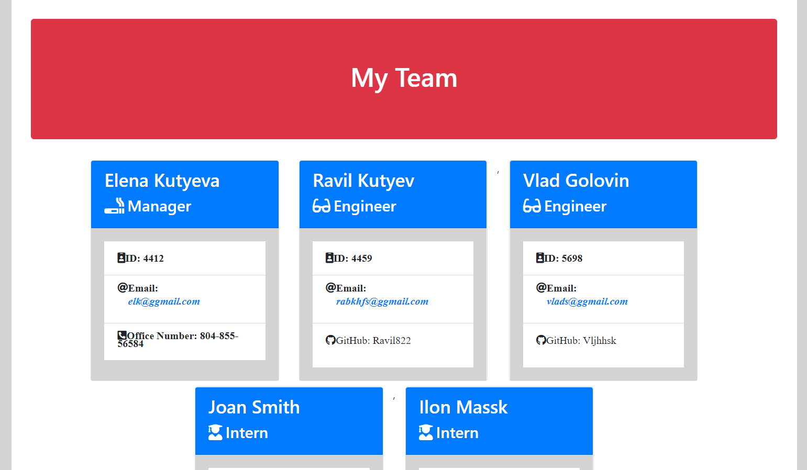

# Team_members

This is a a software engineering team generator command line application. The application will prompt the user for information about the team members.

## How to Use
1. Run NPM INSTALL in the terminal
2. Run NODE APP.
3. Answer the prompt.
4. Once completed a myteam.html file will be created
5. Open myteam.html in browser to view the result.

# Repository access link

https://github.com/Ravil822/Team_members

# Output Demo

  

# Terms

THE SOFTWARE IS PROVIDED "AS IS", WITHOUT WARRANTY OF ANY KIND, EXPRESS OR IMPLIED, INCLUDING BUT NOT LIMITED TO THE WARRANTIES OF MERCHANTABILITY, FITNESS FOR A PARTICULAR PURPOSE AND NONINFRINGEMENT. IN NO EVENT SHALL THE AUTHORS OR COPYRIGHT HOLDERS BE LIABLE FOR ANY CLAIM, DAMAGES OR OTHER LIABILITY, WHETHER IN AN ACTION OF CONTRACT, TORT OR OTHERWISE, ARISING FROM, OUT OF OR IN CONNECTION WITH THE SOFTWARE OR THE USE OR OTHER DEALINGS IN THE SOFTWARE.